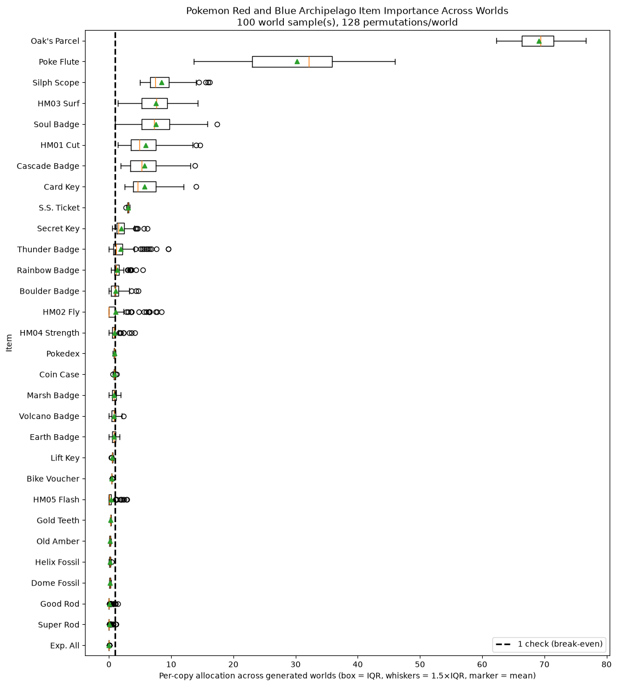

# Archipelago Shapley Item Valuation

Estimate the intrinsic logical usefulness of items in Archipelago worlds.
The analyzer generates legal worlds from player YAMLs, samples physical-item
permutations, and measures how many checks each item makes reachable.

The project targets Archipelago 0.6.7 and runs natively on Windows with Python
3.13. Analyses are independent per player/game; the combined batch plot is a
cross-game comparison, not one joint cooperative Shapley game.

## Quick start for Windows

This is the shortest path from a fresh copy of the repository to a first
item-value plot. Run these commands in PowerShell from the repository folder.

### 1. Install Python 3.13 and Git

Install [Python 3.13](https://www.python.org/downloads/) and
[Git for Windows](https://git-scm.com/download/win) if they are not already
installed. During Python installation, enable **Add Python to PATH**. To use
the included exploration notebook, also install
[Visual Studio Code](https://code.visualstudio.com/) plus its **Python** and
**Jupyter** extensions.

### 2. Download the matching Archipelago source

The analyzer reads Archipelago's game logic directly, so it needs the 0.6.7
source tree beside the project code:

```powershell
git clone --branch 0.6.7 --depth 1 `
    https://github.com/ArchipelagoMW/Archipelago.git `
    .\Archipelago
```

This does not install or launch the Archipelago client. It supplies the rules
used to answer questions such as “can this inventory reach this location?”

### 3. Create the Python environment and install dependencies

```powershell
py -3.13 -m venv .venv
.\.venv\Scripts\python.exe -m pip install --upgrade pip
.\.venv\Scripts\python.exe -m pip install -r .\ap_requirements_windows.txt
```

You only need to create the environment once.

### 4. Run the included example

```powershell
.\.venv\Scripts\python.exe .\run_local.py `
    .\examples\pokemon_rb_default.yaml
```

This deliberately performs a tiny test: two generated worlds, four Shapley
pairs per world, and two worker processes. A successful run prints a summary
and saves:

```text
output/pokemon_rb_default_analysis.pkl.gz
```

Healthy output includes `pending=0`, `unreachable=0`, a true completion
condition, and a conservation difference of zero or extremely close to zero.

### 5. Analyze your own Archipelago YAML

Create the private input folder, then copy one of your normal Archipelago
player YAMLs into it:

```powershell
New-Item -ItemType Directory -Force .\local_yamls
```

For example, if you name the file `my_game.yaml`, run:

```powershell
.\.venv\Scripts\python.exe .\run_local.py `
    .\local_yamls\my_game.yaml
```

YAMLs in `local_yamls/` are ignored by Git, so player names and settings will
not accidentally be committed. Start with the small defaults above. Once the
test succeeds, request a more stable estimate:

```powershell
.\.venv\Scripts\python.exe .\run_local.py `
    .\local_yamls\my_game.yaml `
    --world-samples 100 `
    --shapley-pairs 64 `
    --n-jobs 16
```

More worlds capture variation between legal seeds; more Shapley pairs reduce
sampling noise within each world. Large runs can take a long time, so scale up
gradually.

### 6. Open the result and make plots

Open `explore_analysis.ipynb` in VS Code, select `.venv` as the notebook
kernel, and run the cells from top to bottom. It initially opens the public
Pokémon example result from step 4. For your own analysis, change the
`ANALYSIS_PATH` line in the first cell to the filename printed by
`run_local.py`. The key commands are:

```python
analysis.print_summary()        # correctness and run diagnostics
analysis.display_items()        # scrollable item table
analysis.plot(top_n=30)          # highest-valued individual item copies
analysis.audit_item("Item Name")
analysis.audit_location("Location Name")
```

The box plot ranks items by mean `shapley_per_copy`. The box and whiskers show
how the item's value changes across generated worlds, and the triangle is its
mean. Outlier markers are hidden by default but still affect every calculation.

### Example output

This 100-world Pokémon Red/Blue analysis shows the default per-copy item
ranking with outlier worlds displayed:



That is the complete single-game workflow. To analyze a folder of player
YAMLs and create a combined cross-game plot, continue to
[Run every YAML as a batch](#run-every-yaml-as-a-batch).

## Supported games

Locally validated:

- Ocarina of Time
- Pokemon Red and Blue
- Sonic Adventure 2 Battle
- Paint
- Subnautica
- Starcraft 2
- Celeste (Open World)
- Dark Souls Remastered 0.2.6 via an explicit local APWorld
- Majora's Mask Recompiled 0.9.5.post2 via an explicit local APWorld

Built-in games are discovered from the local Archipelago source. External
games must be supplied as their exact `.apworld` files; the analyzer never
downloads or silently substitutes plugin versions.

## Local setup

Expected layout:

```text
ap_shapley_project/
├── .venv/
├── Archipelago/                 # Archipelago 0.6.7 checkout
├── ap_shapley/
├── external_apworlds/
│   ├── dsr.apworld
│   └── mm_recomp.apworld
├── batch_yamls/                 # private inputs consumed by run_batch.py
├── local_yamls/                 # private experiments and one-off YAMLs
├── private_notebooks/            # private paths/notes; ignored by Git
├── examples/                    # sanitized YAMLs tracked by Git
├── output/                      # single-analysis output
├── results/                     # batch outputs
├── run_local.py
├── run_batch.py
└── explore_analysis.ipynb
```

Install the scoped runtime dependencies into the existing virtual environment:

```powershell
.\.venv\Scripts\python.exe -m pip install -r .\ap_requirements_windows.txt
```

The `.venv`, Archipelago checkout, APWorlds, `batch_yamls`, `local_yamls`,
`private_notebooks`, and generated results are intentionally excluded from
Git. Sanitized files under `examples/` are explicitly tracked so a fresh clone
has something runnable. The tracked `explore_analysis.ipynb` contains only the
public example workflow.

Ignored directories are not created by Git on a fresh clone. Create them as
needed:

```powershell
New-Item -ItemType Directory -Force `
    .\batch_yamls, `
    .\local_yamls, `
    .\external_apworlds, `
    .\output, `
    .\results
```

Use the folders as follows:

```text
examples/       public, sanitized examples supplied by the repository
local_yamls/    private experiments and one-off player configurations
batch_yamls/    private YAMLs that run_batch.py should process together
```

To try the example as part of a batch without modifying the tracked file:

```powershell
Copy-Item .\examples\pokemon_rb_default.yaml .\batch_yamls\
```

## Run one YAML locally

`run_local.py` accepts any supported player YAML. Its safe defaults are two
worlds, four antithetic pairs per world, and two worker processes:

```powershell
.\.venv\Scripts\python.exe .\run_local.py `
    .\examples\pokemon_rb_default.yaml
```

Scale it explicitly:

```powershell
.\.venv\Scripts\python.exe .\run_local.py `
    .\local_yamls\my_player.yaml `
    --world-samples 100 `
    --shapley-pairs 64 `
    --n-jobs 20
```

By default this saves:

```text
output/<yaml_name>_analysis.pkl.gz
```

Choose another destination with:

```powershell
--output .\output\my_analysis.pkl.gz
```

DSR and MM automatically use `external_apworlds/dsr.apworld` and
`external_apworlds/mm_recomp.apworld` when those files exist. An additional
external plugin can be supplied with a repeatable `--apworld` option.

## Check all YAMLs before a large batch

Run the small Windows multiprocessing compatibility check:

```powershell
.\.venv\Scripts\python.exe .\compatibility_check.py `
    .\batch_yamls `
    --apworld .\external_apworlds\dsr.apworld `
    --apworld .\external_apworlds\mm_recomp.apworld `
    --world-samples 2 `
    --shapley-pairs 4 `
    --n-jobs 2
```

Healthy results report:

```text
PASS
pending=0
unreachable=0
conservation=0
goal=True
```

## Run every YAML as a batch

`run_batch.py` analyzes every `.yaml`/`.yml` file directly inside
`batch_yamls` and saves one `AnalysisResult` plus one plot per file.

Its default intermediate workload is:

```text
world_samples = 20
shapley_pairs = 16
n_jobs = 16
```

Run it with:

```powershell
.\.venv\Scripts\python.exe .\run_batch.py
```

Example larger run:

```powershell
.\.venv\Scripts\python.exe .\run_batch.py `
    --world-samples 100 `
    --shapley-pairs 64 `
    --n-jobs 20 `
    --plot-top-n 30 `
    --combined-top-n 100
```

Outputs resemble:

```text
results/
├── player_oot_ocarina_of_time.pkl
├── player_oot_ocarina_of_time.png
├── player_dsr_dark_souls_remastered.pkl
├── player_dsr_dark_souls_remastered.png
├── ...
├── combined_item_results.csv
└── combined_item_plot.png
```

The combined table appends the independent item result tables with game/YAML
identity. The combined plot ranks items by `shapley_per_copy`.

### Rerun one game and rebuild the combined plot

```powershell
.\.venv\Scripts\python.exe .\run_batch.py `
    --yaml .\batch_yamls\dsr.yaml `
    --world-samples 100 `
    --shapley-pairs 64 `
    --n-jobs 20 `
    --combined-top-n 100
```

Only that analysis is regenerated. Existing saved analyses for the other
games are loaded when rebuilding the combined outputs.

### Rebuild only the combined outputs

```powershell
.\.venv\Scripts\python.exe .\run_batch.py `
    --combine-only `
    --combined-top-n 100
```

No worlds or Shapley permutations are rerun.

## Explore a saved analysis

Open `explore_analysis.ipynb` in VS Code and select this project's `.venv` as
the notebook kernel. Load a trusted result file:

```python
from pathlib import Path
import sys

PROJECT_ROOT = Path.cwd()
sys.path.insert(0, str(PROJECT_ROOT / "Archipelago"))
sys.path.insert(0, str(PROJECT_ROOT))

from ap_shapley import AnalysisResult

analysis = AnalysisResult.load(
    PROJECT_ROOT / "output" / "pokemon_rb_default_analysis.pkl.gz"
)
```

Useful notebook calls:

```python
analysis.print_summary()
analysis.display_items(max_height=500)
analysis.plot(top_n=30)
analysis.plot(top_n=30, show_outliers=True)

analysis.audit_item("Zeldas Lullaby", top_n=30)
analysis.plot_audit("Zeldas Lullaby", top_n=30)
analysis.audit_location("Sheik in Forest")
analysis.display_location_audit("Sheik in Forest", max_height=480)
```

Tables and plots rank by `shapley_per_copy` by default. Use
`metric="family_total"` explicitly when comparing the collective allocation
of repeated families:

```python
analysis.plot(metric="family_total")
analysis.top_items(30, metric="family_total")
```

Outlier points are hidden by default for readability, but they remain part of
the means, rankings, and saved data.

Only load analysis files you trust: persistence uses Python pickle.

## Methodology in brief

For a fixed generated world:

```text
v(S) = number of scored checks reachable with inventory S
```

The canonical estimator uniformly permutes all physical copies belonging to
logically relevant item families. Each random permutation is paired with its
reverse for variance reduction. `shapley_pairs=64` therefore evaluates 128
permutations per generated world.

Important semantics:

- ordinary shuffled items activate immediately when offered;
- locked physical items remain pending until their generated source is reachable;
- automatic event/state tokens are never Shapley players;
- precollected items exist in every base state and are not players;
- automatic events and pending items close to a fixed point;
- completion releases remaining scored checks by default;
- all copies of a relevant logical family participate, including equivalent
  copies AP may classify as filler;
- family totals and per-copy averages are reported separately.

Every item-dependent check should conserve exactly one point:

```text
sum(family_total) = item-dependent scored checks
```

The analyzer averages these fixed-world allocations over independently
generated legal worlds from the YAML. Item means are conditional on that item
existing in a sampled world.

## Tests

Run the lightweight regression suite with:

```powershell
.\.venv\Scripts\python.exe -m unittest discover -s tests -p "test_*.py" -q
```

The suite covers physical-copy allocation, repeated/count families,
progressive interleavings, acquisition constraints, automatic event cascades,
precollected inventory, special placement hooks, DSR event classification,
and the supported-game loader.

## License

This project is available under the [MIT License](LICENSE). It is an
independent analysis tool and is not an official Archipelago project.
